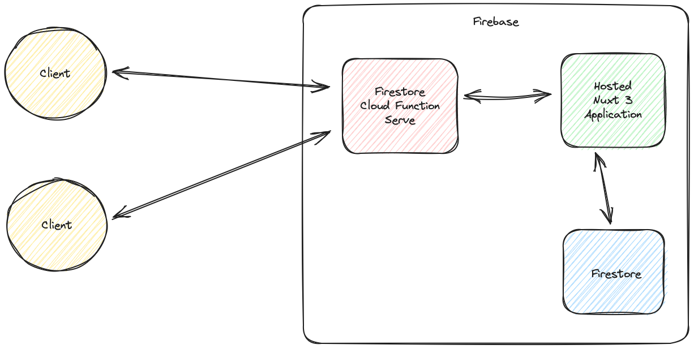

# Feedback Management Application

You can view the website globally [here](https://feedback-management-92e11.web.app)

Using the application is fairly simple. I kept it easy to use. Using the Navbar at the top you can navigate between our 3 pages. Submit feedback lets you create new feedback, and View Feedback lets you see the list of feedback. Viewing feedback is filterable on the sentiment and it is filtered on the server side via new requests not locally.

### For Running locally

```bash
# npm
npm install

npm run dev
```

To get/send data locally you will need to run the firebase setup, which I outline below:

### For Deploying To Firbase

You will need to make sure your directory is setup for your firebase account. You will need to have firebase-tools installed globally and run firebase login in this directory. Make sure to create a new project in firebase as well as make a web-app in that project so you can get the firebaseconfig. You will also want to setup a firestore db with collection: `feedback`, and in your collection rules use the default but change the `false` to `true`.

```bash
firebase login

"hosting": { "site": "PROJECT NAME HERE" } // In ./firebase.json

and

"projects": { "default": "PROJECT NAME HERE" } // In ./firebaserc

and

const firebaseConfig = { YOUR FIREBASE CONFIG HERE } // In server/lib/firebase.ts
```

Finally to deploy you can just run

```bash
npm run build-and-deploy
```

This command does some funky stuff since nuxt 3 and firebase have had some issues recently with deployment. Basically nuxt 3 firebase preset deployments are broken for the time being and we needed to do some work arounds. You can learn more about this [here](https://github.com/nuxt/nuxt/issues/23496). This was such a pain to figure out for my first deployment to firebase.

#### Firebase deployment to multi website projects

There are a few small config changes requried if you deploy this app to a project with existing hosted apps. Especially for serving the app via the server cloud function. I reccomend if you try this to just create a new one.

## Hosting/Backend

This application is hosted on Firebase and the Backend is also on Firebase. While the directions did say to use GCP Cloud Functions and Postgresql I was unable to learn this platform in a few hours to complete this project. I did try to make GCP work and was working on it for a few hours. However this was not progressing fast enough. Learning firebase was already a hurdle as I haven't used it before. I could make this serverless entirely in half an hour if I was to use AWS, or Deno Deploy but GCP had too many things to learn in a few hours. I hope this is not too much of an issue, GCP is just very heavy in a short time when you are used to other products.

This project uses the hosting service and firestore from firebase. There is a Firebase cloud function which is used to serve the application which you can see in the firebase.json file. Otherwise we are just using the Nuxt App as a Full Stack application using the Nitro Server. API calls go through our server/api routes which talk directly to our firestore database.

## Testing

I used Vitest for testing. Setting up Jest was a pain and the reccomended way to test nuxt was with vitest. Vitest is also faster to test with and is all around a better DX in my opinion.

You can run the unit tests with:

```bash
npm run test
```

You can run the coverage reports:

```bash
npm run coverage
```

I only added unit testing to the frontend as I was unable to figure out how to test nuxt backend functions. If this was on GCP or AWS I could test those more easily outside of nuxt, however without knowing nuxt I wasn't able to figure out how to test that in a few hours, the prebuilt composables were strange to setup for testing.

## File Structure

Our SubmitForm.vue and ViewFeedbackTable.vue were pulled out as component for two reasons:

1. For Testing we could isolate the useFetch()
2. To show composition api usage with props/emiting and proper vue techniques

```bash
.
├── components
│   ├── Header.vue // This is the header for the application
│   ├── SubmitForm.vue // This is our Form for creating feedback
│   └── ViewFeedbackTable.vue // This is our table for viewing feedback
├── pages
│   ├── feedback
│       ├── Submit.vue //  This page displays our SubmitForm.vue and handles posting our feedback to the DB
│       └── View.vue // This page displays our ViewFeedbackTable.vue and handles getting our feedback from the DB
│   ├── index.vue // This is our home page which is rendered with SSR, other pages are just default
├── server
│   ├── api
│       ├── feedback.get.ts // This is our api route to get feedback
│       └── feedback.post.ts // This is our api route to send feedback
│   ├── lib
│       ├── firebase.ts // This is our firebase config to connect
│       └── firestore.ts // These are our functions to interact with the firestore DB
```

## Architecture



## Other Tech Used

1. Nuxt UI
   - This is used to give me some basic components, the cards, table, input fields ect
2. TailwindCss
   - I used this to improve the look of the app
3. Zod
   - Zod is a excellent runtime validation tool for JS/TS. I used it for our form submissions as it integrated nicely with the Nuxt UI form group but I use zod in my own projects for all things validation. Zod mixes TS types with type inference and runtime type checking and can't be beat.

## What I learned

1. Nuxt!
   - I started a nuxt project a few days prior to this so I was really learning Nuxt in real time. I really enjoyed Nuxt and would certainly prefer it in the future for all things I do.
2. Firebase
   - I have never used firebase either and while the hosting took longer than expected due to a recent nuxt/firebase bug from a month ago I was able to pick it up fairly fast especially the firestore so I could maintain a DB for the project. I enjoyed firebase and would use it in the future, it doesnt replace Deno Deploy for me however its a close second
3. GCP Cloud Functions
   - While I couldnt use this for my backend in time I was able to learn a lot about Cloud Functions. They worked fairly similair to AWS Lambda and I did stand up the Cloud Functions for this project I just didn't have the database connectivity and functionality working. The deployment of these in particular was much nicer than AWS Lambda.
